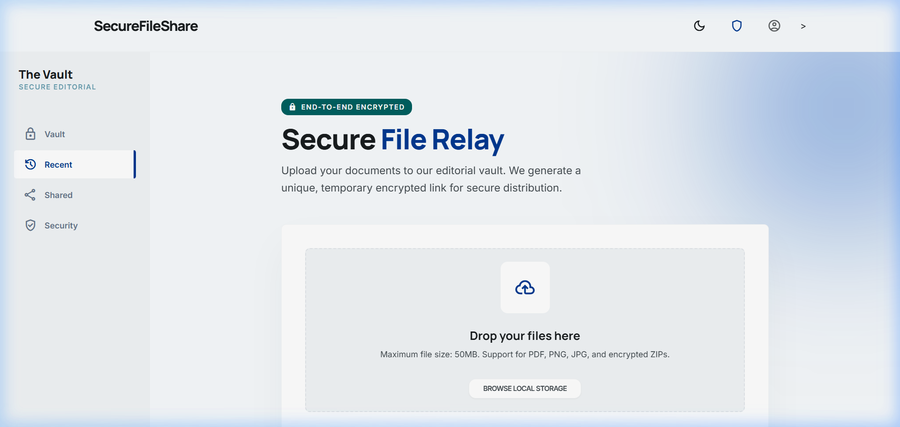
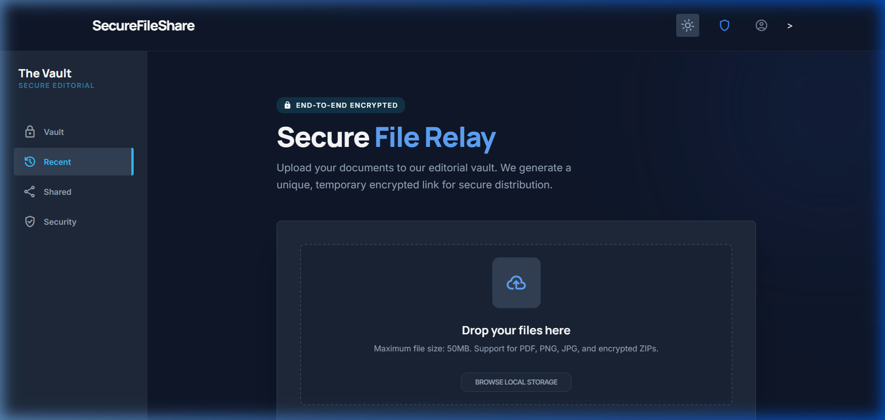
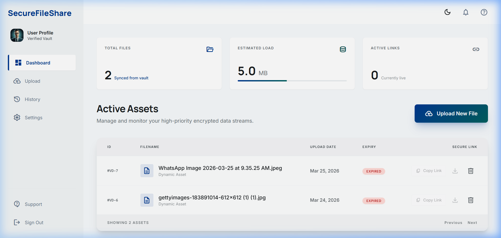
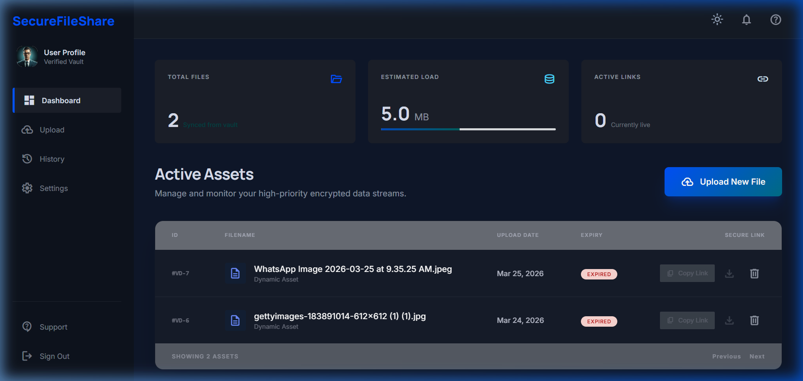
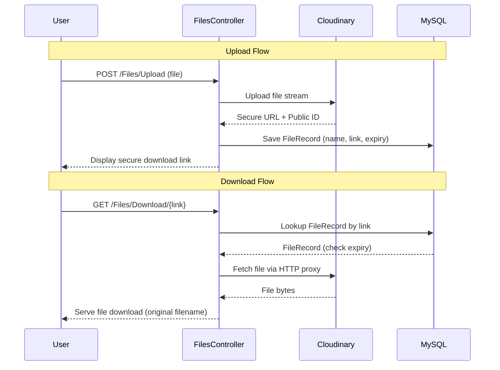

<p align="center">
  
  
  
  
  
</p>

<h1 align="center">🔒 SecureFileShare</h1>

<p align="center">
  <strong>A secure, cloud-based file sharing platform with expiring download links</strong>
</p>

<p align="center">
  Upload files to the cloud, generate unique time-limited download links, and manage everything from a sleek dashboard — all with proxied downloads that never expose direct cloud URLs.
</p>

---

## 📸 Screenshots

### Upload Page

| Light Mode | Dark Mode |
|:---:|:---:|
|  |  |

### Dashboard

| Light Mode | Dark Mode |
|:---:|:---:|
|  |  |

---

## ✨ Features

| Feature | Description |
|---|---|
| ☁️ **Cloud File Upload** | Files are uploaded directly to Cloudinary via secure API — no local file storage needed |
| 🔗 **Unique Secure Links** | Each upload generates a unique, shareable download link |
| ⏳ **24-Hour Auto-Expiry** | Download links automatically expire after 24 hours for enhanced security |
| 🛡️ **Proxied Downloads** | Files are served through the server as a proxy — end users never see the direct Cloudinary URL |
| 📊 **Admin Dashboard** | View all uploaded files, track active vs expired links, copy links, and delete files |
| 🗑️ **Cloud + DB Deletion** | Deleting a file removes it from both Cloudinary storage and the MySQL database |
| 🌙 **Dark Mode** | Full dark/light theme toggle with system preference detection and localStorage persistence |
| 📱 **Responsive Design** | Modern, glassmorphic UI built with Tailwind CSS and Material Design icons |

---

## 🏗️ Architecture

```
SecureFileShare/
├── Controllers/
│   ├── FilesController.cs       # Upload, Download, Dashboard, Delete endpoints
│   └── HomeController.cs        # Home/Error handling
├── Models/
│   └── FileRecord.cs            # Entity model (Id, OriginalName, SavedName, DownloadLink, UploadTime, ExpiryTime)
├── Data/
│   └── AppDbContext.cs           # EF Core DbContext with Files DbSet
├── Views/
│   ├── Files/
│   │   ├── Index.cshtml          # Upload page with drag-and-drop UI
│   │   └── Dashboard.cshtml      # File management dashboard with stats
│   └── Shared/
│       └── _SecureLayout.cshtml  # Base layout with Tailwind config, dark mode, and animations
├── Program.cs                    # App startup, MySQL config, middleware pipeline
├── .env                          # Cloudinary credentials (not committed)
└── appsettings.json              # MySQL connection string
```

### Request Flow



---

## 🚀 Getting Started

### Prerequisites

- [.NET 10 SDK](https://dotnet.microsoft.com/download/dotnet/10.0)
- [MySQL Server](https://dev.mysql.com/downloads/mysql/) (running locally)
- [Cloudinary Account](https://cloudinary.com/) (free tier works)

### 1. Clone the Repository

```bash
git clone https://github.com/AjayPieris/SecureFileShare-.net-.git
cd SecureFileShare-.net-
```

### 2. Configure Environment Variables

Create a `.env` file in the project root:

```env
CLOUDINARY_CLOUD_NAME=your_cloud_name
CLOUDINARY_API_KEY=your_api_key
CLOUDINARY_API_SECRET=your_api_secret
```

### 3. Configure MySQL Connection

Update the connection string in `appsettings.json`:

```json
{
  "ConnectionStrings": {
    "DefaultConnection": "Server=localhost;Database=SecureFileShareDb;User=root;Password=your_password"
  }
}
```

### 4. Apply Database Migrations

```bash
dotnet ef database update
```

### 5. Run the Application

```bash
dotnet watch run
```

The app will be available at **http://localhost:5070**

---

## 🔑 API Endpoints

| Method | Route | Description |
|--------|-------|-------------|
| `GET` | `/` | Upload page (Index) |
| `POST` | `/Files/Upload` | Handles file upload to Cloudinary |
| `GET` | `/Files/Download/{link}` | Proxied secure file download |
| `GET` | `/Files/Dashboard` | File management dashboard |
| `POST` | `/Files/Delete/{id}` | Delete file from Cloudinary & DB |

---

## 🛠️ Tech Stack

| Technology | Purpose |
|---|---|
| **ASP.NET Core MVC (.NET 10)** | Backend framework, routing, and server-side rendering |
| **Entity Framework Core 9** | ORM for MySQL database interactions |
| **Pomelo.EntityFrameworkCore.MySql** | MySQL provider for EF Core |
| **Cloudinary SDK** | Cloud file storage and management |
| **Tailwind CSS (CDN)** | Utility-first CSS framework for responsive UI |
| **Material Symbols** | Google icon font for UI elements |
| **DotNetEnv** | Environment variable management from `.env` files |

---

## 🔒 Security Features

- **Proxied Downloads** — Files are fetched server-side from Cloudinary and streamed to the client, ensuring the direct cloud URL is never exposed to end users.
- **Time-Limited Links** — Every download link expires automatically after 24 hours, preventing indefinite access.
- **UUID-Based Identifiers** — Cloudinary public IDs use `Guid.NewGuid()` for unpredictable, collision-resistant file references.
- **Delete Confirmation** — Client-side confirmation dialog prevents accidental file deletions.

---

## 📄 License

This project is open source and available under the [MIT License](LICENSE).

---

<p align="center">
  Built with ❤️ by <a href="https://github.com/AjayPieris">Ajay Pieris</a>
</p>
